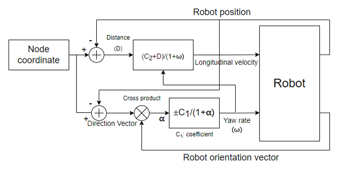
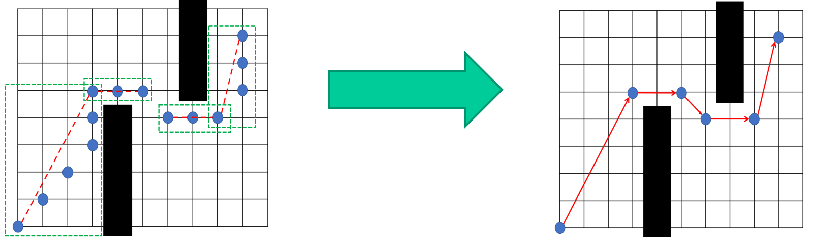
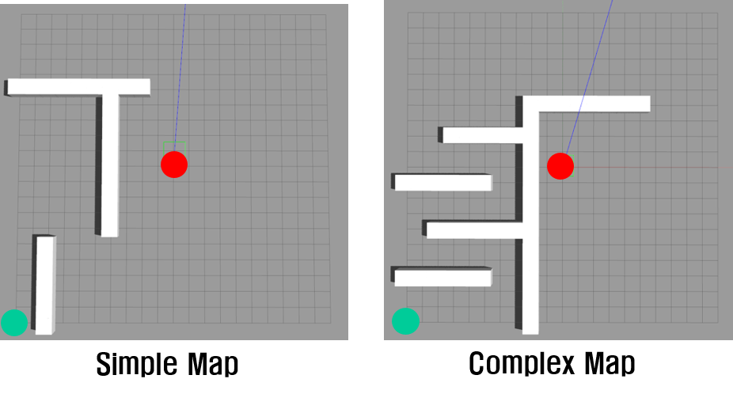
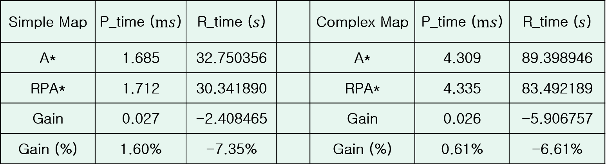
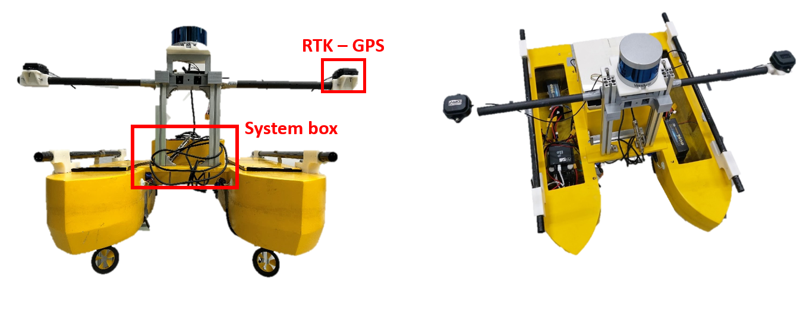
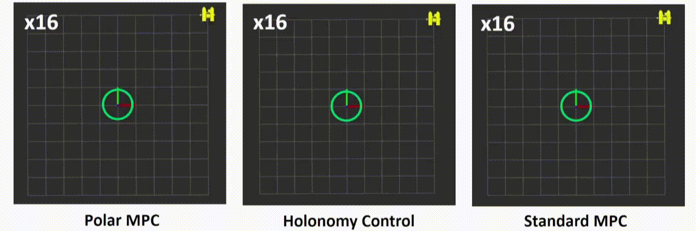

# 🤖 Seokhyun Hong's Robotics Portfolio

A collection of robotics projects including UGV, USV, and Excavator simulations and field tests. Built with ROS, Gazebo, Unity, and custom C++/Python code.

---

## 🚗 UGV Simulation  
**At Hanyang University - Department of Automotive Engineering Senior Project**

- Developed a differential-drive robot in URDF
- Exploited [sjtu_drone](https://github.com/tahsinkose/sjtu-drone) as a goal point
- Built using ROS Melodic, Gazebo, and C++

### 🧩 System Overview

UGV control system diagram:  

🔗 [GitHub Repository](https://github.com/amoogeona11/Reduced-path-Iterative-A-star)

---

### 🗺️ A* Path Planning

**Grid map-based A* algorithm implementation**  
- Implemented in C++
- ROS node integration with Gazebo simulation

📹 [▶️ Watch video](https://youtu.be/fq33Nl0Rb3Q)

---

### ♻️ A* Path Reduction

- Reduced unnecessary waypoints
- Optimized for smoothness and efficiency
- Obstacle-aware pruning logic

📹 [▶️ Watch video](https://youtu.be/kfxGbPY_JvY)

---

### 💻 Simulation Maps & Performance Comparison

- Process time (`P_time`): A* computation time  
- Runtime (`R_time`): Actual time robot takes to reach the goal

| Simulation Environment | Performance Table |
|------------------------|-------------------|
|  |  |

---

### 🚧 Obstacle Avoidance

- Combines global path planning with local obstacle avoidance  
- Dynamic re-planning with live obstacle updates

📹 [▶️ Watch video](https://youtu.be/nBfN8mHjhsk)

---

## 📱 Sensor Fusion
Exploited Error-state Kalman Filter
### Camera-IMU sensor fusion
- Prediction: IMU integration (position, velocity, orientation)
- Correction: Pose estimation using Aruco marker (position, orientaion)

**Developed for Indoor experiment**📹 [▶️ Watch video](https://youtu.be/gelpOx11oOY)

### GPS-IMU sensor fusion
- Prediction: IMU integration (position, velocity, orientation)
- Correction: Dual RTK-GPS considering extrinsic with the USV (position)

**Developed for Outdoor experiment**

## 🚤 USV Simulation & Field Test
Unmanned surface vessel (USV) simulation and real-world testing.  

### Lake Cleaning USV
**At Seoul National University Interactive & Networked Robotics Laboratory(Prof. Dongjun Lee)**

**Custom designed and built platform**

System Properties:
- Catamaran structure
- mass: 20.66kg
- inertia(Iz): 1.37 kgm^2
- size: 800 x 640 x 220(mm)
- materials: FRP(body), Aluminum, 3D printed parts

System Specifications:
- Intel Nuc: i5-8th gen
- RTK-GPS (SMC-2000/SMC+)
- Velodyne Puck (VLP-16)
- Pixhawk
- Diskdrive actuator
- Teensy 4.0
- LTE Router

Given cleaning area as a polygon, optimal coverage path is generated.

Controlled with Velocity field path following algorithm using PID control. (Following velocity field using PID control)

Codes validated in simulation, tested indoor and then launched on water bodies.

📹 [Simulation Video](https://youtu.be/kfoeWoRUoZ0)  
📹 [Field Test Video](https://youtu.be/pwgTA8-aSr0)

### Fail-safe Control of the USV with Acuation Failure
Control method developed in case of one side of the USV's actuators malfunctioning.

Utilizing the existance of limit cycle of the system, coordinate system can be converted into polar coordinates. By converting the coordinate system number of the states can be reduced therefore the system becomes controllable. Applying model predictive control on the transformed coordinate system showed better performance and stability than other methods.

Refer to my thesis for more details 

---

## 🚜 Excavator Simulation & Field Test

- Tracked excavator simulation in **Unity**
- Physics-based control using custom rigid-body dynamics
- Simulated force feedback and terrain interaction

  
📹 [▶️ Watch full video](https://youtu.be/nSXMK3pkZn8)

---

> ✨ Built with passion for autonomous systems, control, and real-world robotics challenges.
